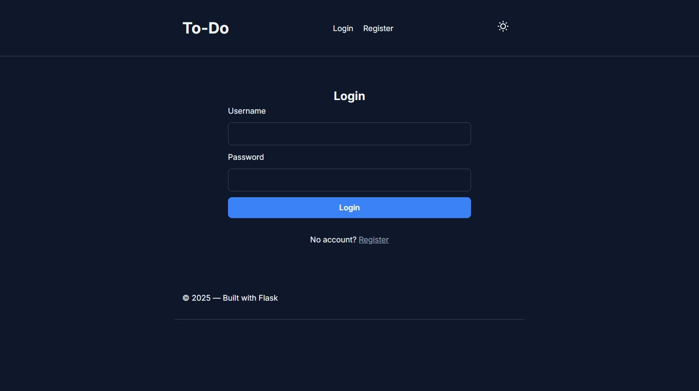

# 📝 Simple To-Do App (Fullstack with Flask)

A sleek, responsive, and minimalistic **To-Do app** built with **HTML, CSS, JavaScript (frontend)** and **Flask, SQLAlchemy, Flask-Migrate, Flask-Login (backend)**. Features include theme toggling (🌞 / 🌙), user authentication, smooth animations, persistent data storage, and production-ready configuration using Gunicorn and environment variables.



---

## 🚀 Features

- ✅ Add, complete, and delete tasks
- 👤 User authentication (login/logout)
- 🌗 Light/Dark mode toggle with sun/moon icons
- 🎨 Custom CSS styling with clean UI
- 💾 Tasks persisted via SQLite or PostgreSQL
- 📱 Responsive layout for mobile and desktop
- ✨ Smooth animations on task changes
- 🔧 Flask configuration for development/production
- 🐘 Gunicorn-ready deployment

---

## 🛠️ Technologies Used

### Frontend:
- HTML5  
- CSS3 (Flexbox, transitions)  
- JavaScript (Vanilla, DOM manipulation, localStorage)

### Backend:
- Python 3
- Flask
- SQLAlchemy
- Flask-Migrate
- Flask-Login
- Flask-WTF (with CSRF protection)

---

## 📦 Setup Instructions

### 1. Clone the Repo

```bash
git clone https://github.com/amritkarma/to-do-flask.git
cd to-do-flask
```

---

### 2. Create a Virtual Environment

```bash
python3 -m venv venv
source venv/bin/activate  # On Windows: venv\Scripts\activate
```

---

### 3. Install Dependencies

```bash
pip install -r requirements.txt
```

---

### 4. Environment Variables

Create a `.env` file in the root directory:

```env
FLASK_APP=app
FLASK_CONFIG=development
FLASK_ENV=development
SECRET_KEY=your-dev-secret-key
DATABASE_URL=sqlite:///db.sqlite3  # or your PostgreSQL URL for production
```

---

### 5. Database Setup

```bash
flask db init
flask db migrate -m "Initial migration"
flask db upgrade
```

---

### 6. Run the Development Server

```bash
flask --app app run --debug --reload
```

Your app will be live at `http://127.0.0.1:5000`

---

### 7. Run in Production with Gunicorn

```bash
export FLASK_CONFIG=production
export SECRET_KEY=your-secure-key
export DATABASE_URL=your-prod-database-url

gunicorn wsgi:app --bind 0.0.0.0:8000 --workers 3
```

---

## 🌙 Theme Toggle (How It Works)

The theme toggle button dynamically switches between:

- **Sun icon** (🌞) when in dark mode
- **Moon icon** (🌙) when in light mode

Mechanism:
- Adds/removes `dark-mode` class on `<body>`
- Persists theme in `localStorage`
- Automatically swaps SVG icons

---

## 💡 Customization Ideas

- 🔄 Add task reordering with drag-and-drop
- 🗓️ Task metadata (due dates, reminders, labels)
- 📱 Add mobile gesture support (swipe to complete/delete)
- 🔒 Extend user authentication with OAuth
- 📊 Add usage analytics or stats dashboard

---

## 🧑‍💻 Author

**Your Name** – [@amritkarma](https://github.com/amritkarma)

If you found this helpful, consider ⭐️ starring the repo!

---

## 📄 License

MIT License — Free to use and modify. See [LICENSE](https://github.com/amritkarma/to-do-flask/blob/main/LICENSE.txt) for details.
